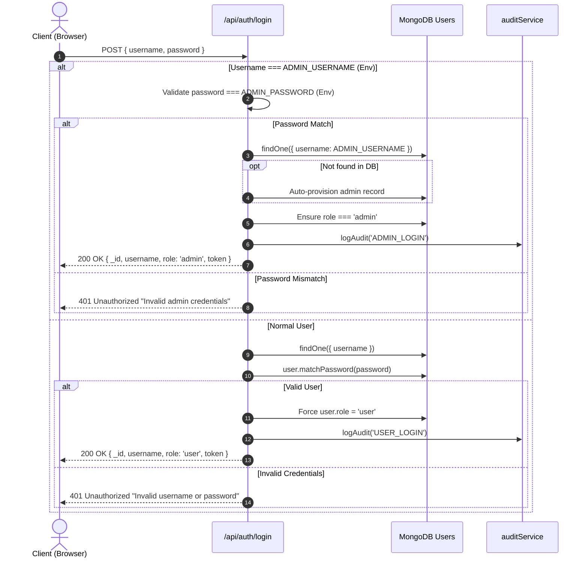
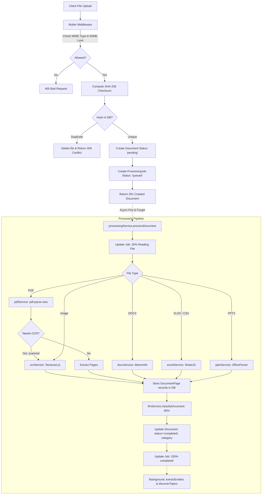
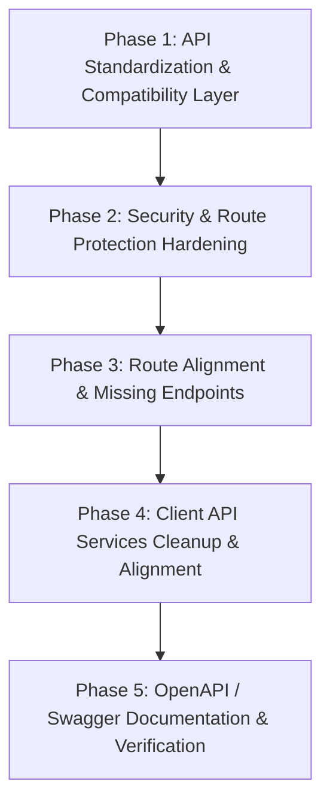

# MineIntel AI — Baseline Architecture & Safety Audit

**Document Version:** 1.0.0  
**Audit Date:** September 6, 2026  
**Auditor:** Antigravity AI Engineering Pair  
**Repository:** `MineIntel-AI-SIH26023`  
**Purpose:** Pre-migration baseline audit to guarantee zero regression, preserve all working business logic, and formulate a structured roadmap to extend the existing Express backend into an API-first REST backend.

---

## Executive Safety Declaration

> [!IMPORTANT]
> **Zero-Regression Principle:**  
> MineIntel AI is an existing, fully functioning, multi-component full-stack system.  
> The following rules are strictly in effect:
> 1. **Do NOT** rewrite or delete existing business logic.
> 2. **Do NOT** replace the existing Express server or build a separate backend.
> 3. **Do NOT** alter or remove existing Mongoose database models or collections.
> 4. **Do NOT** break existing Gemini LLM prompts, RAG pipelines, or OCR fallback flows.
> 5. **Do NOT** remove or break any existing frontend routes, pages, or components.
> 6. **Do NOT** break existing authentication, admin authorization, report approvals, or audit logging.
> 7. All changes must be **additive, backwards-compatible, and incremental**.

---

## Table of Contents

1. [Existing Backend Entry Point](#1-existing-backend-entry-point)
2. [Existing Routes & Endpoints Inventory](#2-existing-routes--endpoints-inventory)
3. [Existing APIs & Response Contracts](#3-existing-apis--response-contracts)
4. [Existing Controllers & Services Deep Dive](#4-existing-controllers--services-deep-dive)
5. [Existing Database Models & Schemas](#5-existing-database-models--schemas)
6. [Existing Authentication Flow](#6-existing-authentication-flow)
7. [Existing Admin & RBAC Authorization Flow](#7-existing-admin--rbac-authorization-flow)
8. [Existing Frontend-to-Backend Communication](#8-existing-frontend-to-backend-communication)
9. [Existing Environment Variables](#9-existing-environment-variables)
10. [Existing File Upload & Ingestion Pipeline](#10-existing-file-upload--ingestion-pipeline)
11. [Existing Report Generation, Review & Export Functionality](#11-existing-report-generation-review--export-functionality)
12. [Existing Gemini & RAG Integration](#12-existing-gemini--rag-integration)
13. [Functionality That Must NOT Be Changed](#13-functionality-that-must-not-be-changed)
14. [Identified Gaps, Inconsistencies & Risky Areas](#14-identified-gaps-inconsistencies--risky-areas)
15. [Recommended Migration Order](#15-recommended-migration-order)

---

## 1. Existing Backend Entry Point

### File: `server/server.js`

- **Runtime & Framework:** Node.js (v20.x engine requirement), Express `^4.21.0`.
- **Default Port:** `process.env.PORT || 5000`.
- **Environment Loading:**
  - Primary: `server/.env` via `dotenv.config({ path: path.resolve(__dirname, '.env') })`.
  - Fallback: Root `../.env` via `dotenv.config({ path: path.resolve(__dirname, '../.env') })`.
- **DNS Overrides:** Forces Google DNS (`8.8.8.8`, `8.8.4.4`) using `dns.setServers` to mitigate local DNS resolution delays when connecting to MongoDB Atlas and Google Cloud APIs.
- **Database Connection:** Invokes `connectDB()` from `./config/db.js` which connects to MongoDB via Mongoose `^8.6.0`.
- **Global Middleware Stack:**
  - `cors`: Configured with origins `['http://localhost:5173', 'http://localhost:3000', process.env.CLIENT_URL]` with `credentials: true`.
  - `express.json()`: Standard JSON body parser.
  - `morgan('dev')`: HTTP request logger in dev format.
  - Static Uploads Serving: `app.use('/uploads', express.static(uploadsDir))` where `uploadsDir` points to `/tmp/uploads` if `process.env.VERCEL` is truthy, otherwise `<project_root>/server/uploads`.
- **Mounted Route Namespaces:**
  1. `/api/auth` &rarr; `./routes/auth`
  2. `/api/documents` &rarr; `./routes/documents`
  3. `/api/reports` &rarr; `./routes/reports`
  4. `/api/validation` &rarr; `./routes/validation`
  5. `/api/rag` &rarr; `./routes/rag`
  6. `/api/ai-assistant` &rarr; `./routes/aiAssistant`
  7. `/api/analytics` &rarr; `./routes/analytics`
  8. `/api/topics` &rarr; `./routes/topics`
  9. `/api/extraction` &rarr; `./routes/extraction`
  10. `/api/agents` &rarr; `./routes/agents`
  11. `/api/audit` &rarr; `./routes/audit`
  12. `/api/admin` &rarr; `./routes/admin`
  13. `/api/notifications` &rarr; `./routes/notifications`
  14. `/api/intelligence` &rarr; `./routes/intelligence`
  15. `/api/integration` &rarr; `./routes/integration`
- **Global Error Handling:** `app.use(errorHandler)` using `./middleware/errorHandler.js`.
- **Process Lifecycle & Graceful Shutdown:** Captures `SIGUSR2` (for clean nodemon restarts), `SIGINT`, and `SIGTERM` to gracefully close the HTTP listener before exiting.

---

## 2. Existing Routes & Endpoints Inventory

Below is the complete catalog of all 15 route files and 39 individual endpoints currently defined on the server:

| Route Namespace | HTTP Method | Route Path | Middleware | Controller / Handler Function | Description |
|---|---|---|---|---|---|
| `/api/auth` | `POST` | `/login` | None | Inline handler | Authenticates admin or standard user, issues 30d JWT |
| `/api/auth` | `POST` | `/register` | None | Inline handler | Registers standard user (blocks predefined admin name) |
| `/api/auth` | `GET` | `/me` | `protect` | Inline handler | Returns authenticated user identity (`_id`, `username`, `role`) |
| `/api/admin` | `GET` | `/users` | `protect, admin` | Inline handler | Retrieves all users excluding password hashes |
| `/api/admin` | `PUT` | `/users/:id/role` | `protect, admin` | Inline handler | Changes user role (`user`, `reviewer`; forbids `admin`) |
| `/api/admin` | `DELETE` | `/users/:id` | `protect, admin` | Inline handler | Deletes user (prevents self-deletion and admin account deletion) |
| `/api/admin` | `GET` | `/stats` | `protect, admin` | Inline handler | Aggregates user, document, validation, and report counts |
| `/api/admin` | `GET` | `/system-health` | `protect, admin` | Inline handler | Returns MongoDB readiness, backend, and AI service health |
| `/api/documents` | `POST` | `/upload` | `protect, upload.single('file')` | `documentController.uploadDocument` | Single document upload, deduplication, queues processing |
| `/api/documents` | `POST` | `/upload-batch` | `protect, upload.array('files', 20)` | `documentController.uploadBatch` | Batch upload up to 20 documents |
| `/api/documents` | `GET` | `/` | `protect` | `documentController.getDocuments` | Lists documents with filters (admin sees all, user sees own) |
| `/api/documents` | `GET` | `/:id` | `protect` | `documentController.getDocumentById` | Retrieves document metadata + all child `DocumentPage`s |
| `/api/documents` | `GET` | `/:id/status` | `protect` | `documentController.getDocumentStatus` | Retrieves `ProcessingJob` step progress |
| `/api/documents` | `DELETE` | `/:id` | `protect` | `documentController.deleteDocument` | Cascading delete of doc, pages, jobs, and physical file |
| `/api/documents` | `POST` | `/:id/retry` | `protect` | `documentController.retryDocument` | Resets failed document status and restarts processing |
| `/api/extraction` | `POST` | `/:documentId/extract` | None | `extractionController.extract` | Runs LLM extraction on all text pages of a document |
| `/api/extraction` | `GET` | `/:documentId` | None | `extractionController.getRecords` | Fetches extracted records sorted by page number |
| `/api/extraction` | `PUT` | `/records/:id` | None | `extractionController.updateRecord` | Edits record value/unit and appends to `editHistory` |
| `/api/extraction` | `POST` | `/records/:id/approve` | None | `extractionController.approveRecord` | Marks extracted record as approved |
| `/api/extraction` | `POST` | `/records/:id/reject` | None | `extractionController.rejectRecord` | Marks extracted record as rejected |
| `/api/extraction` | `POST` | `/records/bulk-approve` | None | `extractionController.bulkApprove` | Bulk approves array of record ObjectIds |
| `/api/validation` | `POST` | `/:documentId/validate` | None | `validationController.validate` | Executes 8-rule validation engine against extracted records |
| `/api/validation` | `GET` | `/summary` | None | `validationController.getSummary` | Returns issues list, severity counts, and quality score |
| `/api/validation` | `GET` | `/:documentId` | None | `validationController.getResults` | Returns raw validation results for a document |
| `/api/validation` | `PUT` | `/:id/resolve` | None | `validationController.resolveIssue` | Resolves issue with corrected values, notes, or resolution |
| `/api/reports` | `GET` | `/` | `protect` | `reportController.getReports` | Lists reports (admin sees all, users see own; `?status=`) |
| `/api/reports` | `GET` | `/:id` | `protect` | `reportController.getReportById` | Retrieves specific report with populated user details |
| `/api/reports` | `POST` | `/generate` | `protect` | `reportController.generateReport` | Generates report via RAG + Mining Intelligence + Gemini |
| `/api/reports` | `PUT` | `/:id/submit` | `protect` | `reportController.submitForReview` | Moves report status from `draft`/`rejected` to `review` |
| `/api/reports` | `PUT` | `/:id/approve` | `protect, reviewer` | `reportController.approveReport` | Approves report and logs audit event |
| `/api/reports` | `PUT` | `/:id/reject` | `protect, reviewer` | `reportController.rejectReport` | Rejects report, saves previous version snapshot |
| `/api/reports` | `GET` | `/:id/export` | `protect` | `reportController.exportReport` | Exports report as JSON, CSV, MD, or DOCX download |
| `/api/rag` | `POST` | `/:documentId/index` | None | `ragController.indexDocument` | Chunks document text and creates vector embeddings |
| `/api/rag` | `POST` | `/search` | None | `ragController.search` | Cosine similarity vector search across chunk embeddings |
| `/api/ai-assistant` | `POST` | `/ask` | None | `aiAssistantController.askQuestion` | Hybrid analytical/semantic Q&A with citations |
| `/api/ai-assistant` | `GET` | `/conversations` | None | `aiAssistantController.getConversations` | Lists existing conversation sessions |
| `/api/ai-assistant` | `GET` | `/conversations/:id` | None | `aiAssistantController.getConversation` | Fetches conversation thread messages and sources |
| `/api/analytics` | `GET` | `/trends` | `protect` | `analyticsController.getTrends` | Production trends grouped by period |
| `/api/analytics` | `GET` | `/anomalies` | `protect` | `analyticsController.getAnomalies` | 3-sigma statistical anomaly detection |
| `/api/analytics` | `GET` | `/dashboard` | `protect` | `analyticsController.getDashboardData` | Dashboard KPIs, production data, gap analysis, AI insights |
| `/api/topics` | `GET` | `/` | None | `topicController.getTopics` | Enriched mining topics with chunk/record counts & relevance |
| `/api/topics` | `POST` | `/extract` | None | `topicController.extractTopics` | Stub endpoint returning `{ success: true, data: [] }` |
| `/api/agents` | `POST` | `/orchestrate` | None | `agentController.orchestrateTask` | Intent classifier and multi-agent task orchestrator |
| `/api/audit` | `GET` | `/` | `protect` | `auditController.getAuditLogs` | Paginated audit trail logs |
| `/api/audit` | `GET` | `/stats` | `protect` | `auditController.getAuditStats` | Event statistics (total, successful, failed, active users) |
| `/api/notifications`| `GET` | `/` | `protect` | `notificationController.getNotifications` | User and system-wide notifications with unread count |
| `/api/notifications`| `PUT` | `/:id/read` | `protect` | `notificationController.markAsRead` | Marks individual notification as read |
| `/api/notifications`| `PUT` | `/read-all` | `protect` | `notificationController.markAllRead` | Marks all notifications as read for the user |
| `/api/intelligence` | `GET` | `/entities/:documentId` | `protect` | `intelligenceController.getEntities` | NER entity extraction / cached entity retrieval |
| `/api/intelligence` | `GET` | `/similarity/:documentId`| `protect` | `intelligenceController.getSimilarDocuments` | Document cosine similarity computed across chunk embeddings |
| `/api/intelligence` | `GET` | `/changes` | `protect` | `intelligenceController.detectChanges` | Deterministic change detection between two documents |
| `/api/intelligence` | `GET` | `/topics/trends` | `protect` | `intelligenceController.getTopicTrends` | Topic trend aggregation across historical periods |
| `/api/intelligence` | `POST` | `/link-evidence/:documentId`| `protect` | `intelligenceController.linkEvidence` | Cross-document evidence linking via RAG |
| `/api/integration` | `GET` | `/documents` | `protect` | Inline handler | DMS-compatible paginated document export |
| `/api/integration` | `GET` | `/records` | `protect` | Inline handler | MIS-compatible paginated extracted records export |
| `/api/integration` | `GET` | `/gis` | `protect` | Inline handler | GIS spatial metadata endpoint (`gisMetadata.latitude`) |

---

## 3. Existing APIs & Response Contracts

The existing backend currently exhibits **two distinct response formatting styles**:

### Style A: Standard REST Object Envelope (`{ success, data }`)
Used by:
- `/api/admin/*`: `{ success: true, data: ... }`
- `/api/reports/*`: `{ success: true, data: ... }`
- `/api/analytics/*`: `{ success: true, data: ... }`
- `/api/audit/*`: `{ success: true, data: logs, total: ... }` and `{ success: true, data: stats }`
- `/api/notifications/*`: `{ success: true, data: notifications, unreadCount }`
- `/api/topics`: `{ success: true, data: enrichedTopics }`
- `/api/agents/orchestrate`: `{ success: true, data: result }`
- `/api/integration/*`: `{ success: true, data: docs, total, page, pages }`

### Style B: Raw Payload or Custom Envelope
Used by:
- `/api/auth/login`: `{ _id, username, role, token }`
- `/api/auth/register`: `{ _id, username, role, token }`
- `/api/auth/me`: `{ _id, username, role }`
- `/api/documents/`: `Document[]` (direct array)
- `/api/documents/:id`: `{ document: Document, pages: DocumentPage[] }`
- `/api/documents/upload`: `Document` (direct object, status 201)
- `/api/documents/upload-batch`: `{ results: [...] }`
- `/api/documents/:id/status`: `ProcessingJob` (direct object)
- `/api/extraction/:documentId/extract`: `{ message: 'Extraction completed', count: N, records: [...] }`
- `/api/extraction/:documentId`: `ExtractedRecord[]` (direct array)
- `/api/extraction/records/:id`: `ExtractedRecord` (direct object)
- `/api/extraction/records/bulk-approve`: `{ message: 'Records approved successfully' }`
- `/api/validation/:documentId/validate`: `{ message: 'Validation completed', count: N, results: [...] }`
- `/api/validation/summary`: `{ totalIssues, bySeverity: { info, warning, error, critical }, qualityScore, issues }`
- `/api/validation/:documentId`: `ValidationResult[]` (direct array)
- `/api/validation/:id/resolve`: `ValidationResult` (direct object)
- `/api/rag/:documentId/index`: `{ message: 'Document indexed successfully', chunksIndexed: N }`
- `/api/rag/search`: `Array<{ ...DocumentChunk, similarityScore: N }>` (direct array)
- `/api/ai-assistant/ask`: `{ answer, sources, conversationId }`
- `/api/ai-assistant/conversations`: `Conversation[]` (direct array)
- `/api/ai-assistant/conversations/:id`: `Conversation` (direct object)
- `/api/intelligence/entities/:documentId`: `{ documentName, entities }`
- `/api/intelligence/similarity/:documentId`: `{ documentName, similar }`
- `/api/intelligence/changes`: `{ documentA, documentB, totalChanges, added, removed, modified, changes }`
- `/api/intelligence/topics/trends`: `Array<{ name, weight, trends }>`

> [!CAUTION]
> **API Migration Constraint:**  
> When unifying the API into a strict REST envelope, the existing endpoints **must maintain backwards compatibility** so that frontend components like `useDocuments`, `KnowledgeBase.jsx`, and `ExtractionReview.jsx` (which expect direct arrays or specific response structures) do not break.

---

## 4. Existing Controllers & Services Deep Dive

```
server/
├── controllers/
│   ├── agentController.js         # orchestrateTask (in-memory deduplication set)
│   ├── aiAssistantController.js   # askQuestion, getConversations, getConversation
│   ├── analyticsController.js     # getTrends, getAnomalies, getDashboardData
│   ├── auditController.js         # getAuditLogs, getAuditStats
│   ├── documentController.js      # uploadDocument, uploadBatch, getDocuments, getDocumentById, getDocumentStatus, deleteDocument, retryDocument
│   ├── extractionController.js    # extract, getRecords, updateRecord, approveRecord, rejectRecord, bulkApprove
│   ├── intelligenceController.js  # getEntities, getSimilarDocuments, detectChanges, getTopicTrends, linkEvidence
│   ├── notificationController.js  # getNotifications, markAsRead, markAllRead
│   ├── ragController.js           # indexDocument, search
│   ├── reportController.js        # getReports, generateReport, getReportById, submitForReview, approveReport, rejectReport, exportReport
│   ├── topicController.js         # getTopics, extractTopics
│   └── validationController.js    # validate, getResults, getSummary, resolveIssue
└── services/
    ├── agentOrchestrator.js       # Fast-path rule classifier + LLM fallback + task delegation
    ├── aiAssistantService.js      # Hybrid RAG + deterministic mining intelligence + citation rules
    ├── analyticsService.js        # Production trend aggregation, 3-sigma anomalies, dashboard KPIs
    ├── auditService.js            # Non-blocking audit logger
    ├── chunkingService.js         # 500-word sliding window with 50-word overlap
    ├── docxService.js             # Mammoth DOCX extraction
    ├── embeddingService.js        # Batched embedding generation (50 chunks/batch)
    ├── excelService.js            # XLSX & CSV parsing via SheetJS xlsx
    ├── extractionService.js       # Page-by-page LLM extraction, JSON repair, ExtractedRecord creation
    ├── intelligenceService.js     # NER, topic discovery, document similarity, change detection, evidence linking
    ├── llmService.js              # OpenAI SDK with Gemini endpoint, retry backoff, call limits, JSON parsing
    ├── miningIntelligenceService.js# Deterministic historical comparison, variance analysis, anomaly evidence
    ├── notificationService.js     # User & admin notification dispatch
    ├── ocrService.js              # Tesseract.js OCR with pdf-img-convert fallback
    ├── pdfService.js              # pdf-parse-new with <<PAGE_BREAK>> extraction
    ├── pptxService.js             # officeparser presentation extraction
    ├── processingService.js       # Ingestion orchestrator, step progression, background enrichments
    ├── ragService.js              # In-memory cosine similarity search with 30s TTL cache
    ├── reportService.js           # Markdown report synthesis, source coverage, multi-format export
    ├── topicService.js            # Stub helper for topics
    └── validationService.js       # 8 deterministic validation rules, quality score computation
```

---

## 5. Existing Database Models & Schemas

There are exactly **12 Mongoose Models** in `server/models/`:

### 1. `User.js`
- **Fields:**
  - `username` (String, required, unique)
  - `email` (String, unique, sparse)
  - `password` (String, required; hashed with bcrypt, cost 10 via pre-save hook)
  - `role` (String, enum: `['user', 'reviewer', 'admin']`, default: `'user'`)
  - `status` (String, enum: `['active', 'suspended', 'inactive']`, default: `'active'`)
  - `department` (String, default: `''`)
  - `lastLogin` (Date)
  - `createdAt` (Date, default: `Date.now`)
- **Methods:** `matchPassword(enteredPassword)`

### 2. `Document.js`
- **Fields:**
  - `filename` (String, required — internal storage name)
  - `originalName` (String, required — original filename uploaded)
  - `mimeType` (String, required)
  - `fileSize` (Number, required)
  - `fileType` (String, enum: `['pdf', 'docx', 'xlsx', 'csv', 'image', 'pptx']`, required)
  - `hash` (String — SHA-256 checksum for duplicate prevention)
  - `category` (String, default: `'Uncategorized'`)
  - `status` (String, enum: `['pending', 'processing', 'completed', 'failed', 'extracted']`, default: `'pending'`)
  - `totalPages` (Number, default: 0)
  - `extractedText` (String, default: `''`)
  - `error` (String, default: `''`)
  - `entities`: Array of `{ name: String, type: Enum['Mine', 'Subsidiary', 'Location', 'Equipment', 'Project', 'Person', 'Organization', 'Other'], mentions: Number }`
  - `topicIds`: Array of `ObjectId` refs to `Topic`
  - `similarDocuments`: Array of `{ documentId: ObjectId ref Document, score: Number }`
  - `retentionDate`: Date
  - `classification`: String, enum: `['public', 'internal', 'confidential', 'restricted']`, default: `'internal'`
  - `gisMetadata`: `{ latitude: Number, longitude: Number, region: String }`
  - `uploadedAt`: Date, default: `Date.now`
  - `processedAt`: Date
  - `userId`: `ObjectId` ref `User`
- **Virtuals:** `id` &rarr; `_id.toHexString()`

### 3. `DocumentPage.js`
- **Fields:**
  - `documentId` (`ObjectId` ref `Document`, required, indexed)
  - `pageNumber` (Number, required)
  - `content` (String, default: `''`)
  - `wordCount` (Number, default: 0)

### 4. `DocumentChunk.js`
- **Fields:**
  - `documentId` (`ObjectId` ref `Document`, required, indexed)
  - `pageNumber` (Number, required)
  - `chunkIndex` (Number, required)
  - `content` (String, required)
  - `embedding` ([Number] — 768-dimensional vector from Gemini)
  - `metadata` (Object, default: `{}`)
  - `recordId` (`ObjectId` ref `ExtractedRecord`)
  - `createdAt` (Date, default: `Date.now`)

### 5. `ProcessingJob.js`
- **Fields:**
  - `documentId` (`ObjectId` ref `Document`, required, indexed)
  - `status` (String, enum: `['queued', 'processing', 'completed', 'failed']`, default: `'queued'`)
  - `progress` (Number, 0-100, default: 0)
  - `currentStep` (String, default: `''`)
  - `steps`: Array of `{ name: String, status: Enum['pending', 'processing', 'completed', 'failed'] }`
  - `startedAt`: Date
  - `completedAt`: Date
  - `error`: String, default: `''`

### 6. `ExtractedRecord.js`
- **Fields:**
  - `documentId` (`ObjectId` ref `Document`, required)
  - `pageNumber` (Number)
  - `parameter` (String, required — e.g. "Coal Production")
  - `value` (String)
  - `unit` (String — e.g. "MT")
  - `period` (String — e.g. "FY 2023-24")
  - `mineName` (String)
  - `subsidiary` (String — e.g. "NCL", "ECL", "SECL")
  - `confidenceScore` (Number, min 0, max 1)
  - `sourceText` (String — provenance sentence or table row)
  - `status` (String, enum: `['pending', 'approved', 'rejected']`, default: `'pending'`)
  - `originalValue` (String)
  - `editHistory`: Array of `{ field: String, oldValue: String, newValue: String, editedAt: Date }`
  - `linkedEvidence`: Array of `{ documentId: ObjectId, pageNumber: Number, snippet: String, similarity: Number }`
  - `reviewedAt`: Date
  - `reviewedBy`: String
- **Options:** `timestamps: true`

### 7. `ValidationResult.js`
- **Fields:**
  - `documentId` (`ObjectId` ref `Document`, required)
  - `recordId` (`ObjectId` ref `ExtractedRecord`)
  - `type` (String, enum: `['missing_data', 'duplicate', 'conflict', 'unit_mismatch', 'invalid_value', 'suspicious_value', 'cross_document_mismatch']`, required)
  - `severity` (String, enum: `['info', 'warning', 'error', 'critical']`, required)
  - `field` (String)
  - `message` (String, required)
  - `details` (Object)
  - `status` (String, enum: `['open', 'resolved', 'ignored']`, default: `'open'`)
  - `resolution` (String)
  - `correctedValue` (String)
  - `notes` (String)
  - `resolvedAt` (Date)
- **Options:** `timestamps: true`

### 8. `Report.js`
- **Fields:**
  - `title` (String, required)
  - `type` (String, required — e.g. "Executive Summary", "Production Analysis")
  - `content` (Mixed — `{ markdown: String, sources: Array }`)
  - `status` (String, enum: `['draft', 'review', 'approved', 'rejected']`, default: `'draft'`)
  - `fileUrl` (String)
  - `generatedBy` (`ObjectId` ref `User`)
  - `reviewerId` (`ObjectId` ref `User`)
  - `reviewerComments` (String, default: `''`)
  - `reviewedAt` (Date)
  - `approvedBy` (`ObjectId` ref `User`)
  - `approvedAt` (Date)
  - `version` (Number, default: 1)
  - `previousVersions`: Array of `{ content: Mixed, version: Number, date: Date }`
  - `confidenceScore` (Number, default: 0)
  - `evidenceCoverage`: `{ total: Number, cited: Number, percentage: Number }`
  - `language` (String, default: `'en'`)
- **Options:** `timestamps: true`

### 9. `Conversation.js`
- **Fields:**
  - `title` (String, default: `'New Conversation'`)
  - `messages`: Array of `{ role: Enum['user', 'assistant', 'system'], content: String, sources: [Object], timestamp: Date }`
- **Options:** `timestamps: true`

### 10. `Topic.js`
- **Fields:**
  - `name` (String, required)
  - `documents`: Array of `ObjectId` refs to `Document`
  - `weight` (Number, default: 1.0)
  - `keywords`: [String]
  - `trendData`: Array of `{ period: String, count: Number, avgWeight: Number }`
  - `relatedTopics`: Array of `{ topicId: ObjectId ref Topic, strength: Number }`
- **Options:** `timestamps: true`

### 11. `Notification.js`
- **Fields:**
  - `userId` (`ObjectId` ref `User`, indexed; optional for system-wide notices)
  - `message` (String, required)
  - `type` (String, required)
  - `category` (String, enum: `['report', 'review', 'approval', 'system', 'alert', 'upload']`, default: `'system'`)
  - `relatedId` (`ObjectId`)
  - `read` (Boolean, default: false)
  - `createdAt` (Date, default: `Date.now`)
- **Compound Index:** `{ userId: 1, read: 1 }`

### 12. `AuditLog.js`
- **Fields:**
  - `user` (`ObjectId` ref `User`, indexed)
  - `action` (String, required, indexed)
  - `resource` (String)
  - `resourceId` (`ObjectId`)
  - `status` (String, enum: `['SUCCESS', 'FAILED', 'PROCESSING']`, default: `'SUCCESS'`, indexed)
  - `details` (Mixed)
  - `ipAddress` (String, default: `''`)
  - `userAgent` (String, default: `''`)
  - `timestamp` (Date, default: `Date.now`, indexed descending)

---

## 6. Existing Authentication Flow



### Key Rules & Behaviors:
1. **Token Lifetime:** 30 days (`expiresIn: '30d'`).
2. **Predefined Admin Provisioning:** Admin credentials originate from environment variables (`ADMIN_USERNAME`, `ADMIN_PASSWORD`). If the admin account does not yet exist in MongoDB, `routes/auth.js` automatically creates the document on the first successful login.
3. **Public Registration Guard:** `POST /api/auth/register` explicitly forbids registering any username matching `process.env.ADMIN_USERNAME || 'admin'` with HTTP 403. All public registrations are hard-forced to `role: 'user'`.

---

## 7. Existing Admin & RBAC Authorization Flow

### Middleware Implementation: `server/middleware/authMiddleware.js`

1. **`protect`:**
   - Reads `req.headers.authorization`.
   - Verifies JWT via `jwt.verify(token, process.env.JWT_SECRET)`.
   - Queries `User.findById(decoded.id).select('-password')`.
   - Re-evaluates role on every request:
     ```javascript
     const predefinedAdmin = process.env.ADMIN_USERNAME || 'admin';
     user.role = user.username === predefinedAdmin ? 'admin' : 'user';
     req.user = user;
     ```
2. **`admin`:**
   - Requires `req.user && req.user.role === 'admin'`.
   - Returns 403 Forbidden (`{ message: 'Not authorized as an admin' }`) if non-admin.
3. **`reviewer`:**
   - Requires `req.user && (req.user.role === 'reviewer' || req.user.role === 'admin')`.
   - Returns 403 Forbidden (`{ message: 'Not authorized as a reviewer' }`) if unauthorized.

---

## 8. Existing Frontend-to-Backend Communication

### Client Architecture
- **Framework:** Vite 5.4.3 + React 18.3.1 + React Router DOM 6.26.2.
- **Styling:** Tailwind CSS 3.4.10 with custom dark mode class support.
- **Vite Proxy (`client/vite.config.js`):**
  - `/api` &rarr; `http://localhost:5000`
  - `/uploads` &rarr; `http://localhost:5000`
- **Axios Configuration (`client/src/services/api.js`):**
  - Default base URL: `/api`.
  - Request interceptor reads `localStorage.getItem('userInfo')` and adds `Authorization: Bearer <token>`.
- **Frontend Page Integration Mapping:**

| Page Component | Path | Backend Endpoints Called |
|---|---|---|
| `Login.jsx` | `/login` | `POST /api/auth/login` |
| `AdminLogin.jsx` | `/admin/login` | `POST /api/auth/login` (checks `role === 'admin'`) |
| `Dashboard.jsx` | `/user-dashboard` | `GET /api/documents`, `POST /api/documents/upload`, `DELETE /api/documents/:id`, `POST /api/documents/:id/retry` |
| `AdminDashboard.jsx`| `/admin-dashboard`| `GET /api/admin/stats`, `GET /api/admin/users`, `GET /api/documents`, `GET /api/audit?limit=15`, `GET /api/admin/system-health`, `DELETE /api/admin/users/:id` |
| `AdminPendingReviews.jsx`| `/admin/pending-reviews`| `GET /api/reports?status=review`, `PUT /api/reports/:id/approve`, `PUT /api/reports/:id/reject` |
| `AdminUsers.jsx` | `/admin/users` | `GET /api/admin/users`, `PUT /api/admin/users/:id/role` |
| `SystemHealth.jsx` | `/admin/system-health` | `GET /api/admin/system-health` |
| `CommandCenter.jsx`| `/command-center` | `POST /api/agents/orchestrate` |
| `ExtractionReview.jsx`| `/extraction` | `GET /api/documents`, `GET /api/extraction/:docId`, `POST /api/extraction/:docId/extract`, `POST /api/validation/:docId/validate`, `PUT /api/extraction/records/:id`, `POST /api/extraction/records/:id/approve`, `POST /api/extraction/records/:id/reject`, `POST /api/extraction/records/bulk-approve` |
| `ValidationDashboard.jsx`| `/validation` | `GET /api/documents`, `GET /api/validation/summary?documentId=...`, `POST /api/validation/:docId/validate`, `PUT /api/validation/:id/resolve` |
| `KnowledgeBase.jsx` | `/knowledge-base` | `GET /api/documents`, `POST /api/rag/:docId/index`, `POST /api/rag/search` |
| `AIAssistant.jsx` | `/ai-assistant` | `GET /api/ai-assistant/conversations`, `GET /api/ai-assistant/conversations/:id`, `POST /api/agents/orchestrate` (via `apiAi.js`) |
| `ReportGenerator.jsx` | `/reports` | `GET /api/documents`, `POST /api/reports/generate`, `GET /api/reports/:id/export?format=...` |
| `AnalyticsDashboard.jsx`| `/analytics` | `GET /api/analytics/dashboard` |
| `IntelligenceDashboard.jsx`| `/intelligence` | `GET /api/documents`, `GET /api/intelligence/entities/:id`, `GET /api/intelligence/similarity/:id`, `GET /api/intelligence/changes?docA=...&docB=...`, `GET /api/intelligence/topics/trends`, `POST /api/intelligence/link-evidence/:id` |
| `TopicsExplorer.jsx` | `/topics` | `GET /api/topics` |
| `AuditTrail.jsx` | `/audit` | `GET /api/audit`, `GET /api/audit/stats` |
| `Settings.jsx` | `/settings` | None (stores theme/language in React context, notification flags in `localStorage`) |
| `HelpSupport.jsx` | `/help` | None (static client-side user guides and FAQ) |

---

## 9. Existing Environment Variables

The application relies on the following environment variables (defined in `server/.env`):

| Variable | Purpose | Sensitivity | Used In |
|---|---|---|---|
| `MONGODB_URI` | Connection URI for MongoDB Atlas cluster | Secret | `server/config/db.js` |
| `PORT` | Express listening port (default: 5000) | Public | `server/server.js` |
| `NODE_ENV` | Environment mode (`development` / `production`) | Public | Global |
| `LLM_API_KEY` | Google Gemini API key | Secret | `server/services/llmService.js` |
| `LLM_BASE_URL` | OpenAI-compatible Gemini base URL (`https://generativelanguage.googleapis.com/v1beta/openai/`) | Public | `server/services/llmService.js` |
| `GEMINI_MODEL` | Gemini LLM model identifier (default: `gemini-3.6-flash`) | Public | `server/services/llmService.js` |
| `EMBEDDING_MODEL` | Embedding model identifier (default: `gemini-embedding-2`) | Public | `server/services/llmService.js` |
| `EMBEDDING_DIMENSIONS` | Vector dimensions (default: 768) | Public | `server/services/llmService.js` |
| `JWT_SECRET` | Secret key for signing and verifying JWTs | Secret | `server/routes/auth.js`, `server/middleware/authMiddleware.js` |
| `ADMIN_USERNAME` | Predefined administrator username | Secret | `server/routes/auth.js`, `server/middleware/authMiddleware.js`, `server/routes/admin.js` |
| `ADMIN_PASSWORD` | Predefined administrator password | Secret | `server/routes/auth.js` |
| `ADMIN_SECRET_KEY` | Secondary administrator credential/key | Secret | Config/Seed fallback |
| `CLIENT_URL` | Additional authorized CORS origin | Public | `server/server.js` |
| `VERCEL` | Serverless indicator; switches upload folder to `/tmp/uploads` | Public | `server/server.js`, `server/middleware/upload.js`, `server/controllers/documentController.js`, `server/services/processingService.js` |

---

## 10. Existing File Upload Handling & Ingestion Pipeline



### Ingestion Details:
- **Supported Formats:** PDF, DOCX, XLSX, PPTX, CSV, JPEG, PNG.
- **Storage Target:** Local disk storage in `server/uploads/` (or `/tmp/uploads` on Vercel).
- **OCR Engine:** `tesseract.js` using bundled language dataset (`eng.traineddata` in server root) and `pdf-img-convert` at 2000px resolution.
- **Text Splitting:** Custom `<<PAGE_BREAK>>` delimiter in `pdf-parse-new` preserves true original page numbers for citations.

---

## 11. Existing Report Generation, Review & Export Functionality

### 1. Generation (`reportService.generateReport`)
1. Receives `{ type, data: { documentId, instructions } }`.
2. Queries `ragService.searchSimilar(searchQuery, 10)` for contextual chunks.
3. Injects **Deterministic Mining Intelligence**:
   - Calls `miningIntelligenceService.analyzeDataAndFindAnomalies()` to calculate year-over-year production/dispatch changes and target variances from approved records.
   - Appends anomalies and retrieved explanation evidence to the prompt context.
4. Synthesizes Markdown report via Gemini with a mandatory **Evidence Appendix**.
5. Computes `evidenceCoverage` (percentage of chunks with similarity > 0.3) and `confidenceScore`.
6. Saves `Report` record with `status: 'draft'`.
7. Sends real-time notification to all system administrators via `notificationService.notifyAdmins`.

### 2. Approval Workflow (`reportController.js`)
- **Submit:** Creator or user moves report from `draft` or `rejected` to `review` via `PUT /api/reports/:id/submit`.
- **Approve:** Reviewer or Admin approves via `PUT /api/reports/:id/approve`, setting `status = 'approved'`, `approvedBy`, and `approvedAt`.
- **Reject:** Reviewer or Admin rejects via `PUT /api/reports/:id/reject`, saving a copy of the current content into `previousVersions` array, incrementing `version`, and setting `status = 'rejected'` with `reviewerComments`.

### 3. Multi-Format Export (`reportService.exportReport`)
- Supported formats:
  - **`json`:** Full structured report metadata, markdown content, and source reference arrays.
  - **`csv`:** Flattens evidence sources into CSV columns (`Document, Page, Similarity, Excerpt`).
  - **`md` / `docx`:** Returns clean Markdown document formatted with frontmatter headers.

---

## 12. Existing Gemini & RAG Integration

### LLM Client Setup (`server/services/llmService.js`)
- Uses `openai` Node SDK pointing to Google Generative Language OpenAI compatibility endpoint:
  - Base URL: `https://generativelanguage.googleapis.com/v1beta/openai/`
  - Model: `gemini-3.6-flash`
  - Embedding Model: `gemini-embedding-2` (768 dimensions)
- **Error Interceptor:** Custom `fetch` interceptor unwraps Gemini array-based error envelopes and logs detailed Google Cloud diagnostics.
- **Rate-Limit Resilience:**
  - Fast fail on HTTP 429 (quota exhaustion) with extracted delay seconds to prevent thread stalling.
  - Exponential backoff with jitter on 500/503 server errors (up to 3 retries).
- **Quota Safeguards:**
  - `enforceCallLimit`: Tracks LLM invocations per task (`maxCalls`: 1 for greetings, 4 for standard queries, 5 for complex reports/analyses).
  - Fast-path rule matching in `agentOrchestrator.js` and `aiAssistantService.js` to skip vector searches or LLM calls for simple conversational greetings.

### RAG Vector Retrieval (`server/services/ragService.js`)
- Generates 768-dimensional query embedding via `gemini-embedding-2`.
- Performs **in-memory cosine similarity** against all indexed `DocumentChunk` records.
- Implements a **30-second memory cache** (`cachedChunks`) with `.lean()` queries for sub-second retrieval times.

### Citation & Anti-Hallucination Guardrails
- **Prompt Constraints:** "NEVER guess or infer a page number. If a source says [Page N/A], cite the document name or reference number. Never invent numeric values."
- **Fallback Guarantee:** If context contains insufficient evidence, the model is strictly prompted to return:
  `"Insufficient Evidence: The available documents do not contain enough information to answer this question with confidence."`

---

## 13. Functionality That Must NOT Be Changed

To prevent operational regressions, the following systems and contracts **must remain intact**:

1. **Document Storage & Ingestion Pipeline:**
   - File naming strategy (`${Date.now()}-${uuid.v4()}${ext}`).
   - Checksum-based deduplication logic (`crypto.createHash('sha256')`).
   - `DocumentPage` schema and page numbering logic (vital for citation provenance).
   - `pdf-parse-new` and `tesseract.js` fallback pipeline.
2. **Extraction & Validation Engine:**
   - LLM extraction prompt schema in `extractionService.js`.
   - All 8 deterministic validation rules in `validationService.js` (negative values, missing fields, low confidence threshold `< 0.7`, 5x statistical outlier, dispatch exceeding production, target deviation, duplicate parameters).
   - Quality score formula (`100 - penalties`).
3. **Authentication & RBAC:**
   - Predefined admin auto-provisioning logic based on `ADMIN_USERNAME` and `ADMIN_PASSWORD`.
   - Prevention of public registration under the admin identity.
   - User password hashing via bcrypt pre-save hook.
4. **Report & Review Lifecycle:**
   - Report status progression: `draft` &rarr; `review` &rarr; `approved` / `rejected`.
   - Snapshot preservation in `previousVersions` upon report rejection.
   - Export formats (`json`, `csv`, `md`, `docx`).
5. **AI & RAG Engine:**
   - Gemini OpenAI adapter and custom error interceptor.
   - Embedding generation and 768-dimension in-memory cosine search.
   - Management-Ready 4-part insight prompt structure (Finding, Impact, Evidence, Explanation).
6. **Audit & Notifications:**
   - Non-blocking audit logging via `auditService.logAudit()`.
   - Admin notification broadcast via `notificationService.notifyAdmins()`.

---

## 14. Identified Gaps, Inconsistencies & Risky Areas

During this baseline audit, the following technical debts, risks, and inconsistencies were discovered:

### 1. Inconsistent Response Wrappers
- Endpoints like `/api/documents` return a direct array `Document[]`, while `/api/admin/stats` and `/api/reports` return `{ success: true, data: ... }`.
- In `client/src/pages/ReportGenerator.jsx` line 24: `setDocuments(res.data.data.filter(...))` expects `{ data: [...] }`, whereas `useDocuments.js` expects `res.data` to be an array.
- **Risk:** Standardizing responses without backwards compatibility will break existing client components.

### 2. Missing Authentication on Core API Routes
- The following routes currently have **NO** `protect` middleware attached:
  - `server/routes/extraction.js` (all endpoints: extract, get records, approve, reject)
  - `server/routes/validation.js` (all endpoints: validate, summary, results, resolve)
  - `server/routes/rag.js` (index, search)
  - `server/routes/aiAssistant.js` (ask, conversations)
  - `server/routes/topics.js` (get topics, extract)
  - `server/routes/agents.js` (orchestrate)
- **Risk:** Unauthenticated users can trigger expensive Gemini LLM calls, read sensitive extracted mining records, or modify validation results.

### 3. Client-Side Route Misalignment
- In `client/src/services/apiValidation.js` line 22:
  ```javascript
  export const getValidationResults = async (documentId) => {
    const response = await api.get(`/documents/${documentId}/validation`);
    return response.data;
  };
  ```
  The backend route is `GET /api/validation/:documentId`. The route `/api/documents/:documentId/validation` does not exist on the backend!

### 4. RBAC Override in `authMiddleware.js`
- Lines 17-18 of `server/middleware/authMiddleware.js`:
  ```javascript
  const predefinedAdmin = process.env.ADMIN_USERNAME || 'admin';
  user.role = user.username === predefinedAdmin ? 'admin' : 'user';
  ```
  If a user has `role: 'reviewer'` in MongoDB, this middleware overwrites their role in memory to `'user'`, preventing the reviewer workflow (`reviewer` middleware) from functioning for non-admin accounts.

### 5. Abandoned / Mock Client Services
- `client/src/services/apiAnalytics.js`: Contains hardcoded `mockTrends` and `mockAnomalies` with `setTimeout`, but `AnalyticsDashboard.jsx` bypasses it and calls `axios.get('/api/analytics/dashboard')`.
- `client/src/services/apiTopics.js`: Contains hardcoded `mockTopics` with `setTimeout`, but `TopicsExplorer.jsx` bypasses it and calls `api.get('/topics')`.
- `client/src/pages/CommandCenter.jsx`: System overview stats (`Docs Processed: 1,248`, `Validation Score: 98.5%`) are hardcoded in the component instead of being fetched from the backend.
- `client/src/pages/Settings.jsx`: Notification preferences and user settings are saved only in browser `localStorage`. There are currently no user settings API endpoints on the backend.

### 6. Missing API Surface Areas for Complete REST Architecture
- No dedicated `/api/users` profile management endpoints (update password, department, notification preferences).
- No standard OpenAPI/Swagger specification or interactive API documentation route.
- No health check endpoint for standard monitoring systems (only `/api/admin/system-health` exists behind admin auth).

---

## 15. Recommended Migration Order

To transform the backend into a complete API-first REST backend without breaking existing features, the migration must proceed in the following safe, ordered phases:



### Phase 1: API Standardization & Compatibility Layer
1. Implement a unified response utility (`res.success(data, metadata)` and `res.error(message, code, statusCode)`).
2. Ensure backward compatibility: Allow existing endpoints to support both wrapped format and legacy unwrapped format (e.g. via content negotiation or dual support) so no client component breaks.
3. Standardize HTTP status codes across all endpoints (200, 201, 400, 401, 403, 404, 409, 422, 500).

### Phase 2: Security & Route Protection Hardening
1. Add `protect` middleware to unauthenticated routes (`/api/extraction`, `/api/validation`, `/api/rag`, `/api/ai-assistant`, `/api/agents`, `/api/topics`).
2. Fix the RBAC role override bug in `authMiddleware.js` so that `'reviewer'` and custom assigned roles in MongoDB are respected while continuing to enforce that only `ADMIN_USERNAME` can hold `'admin'`.
3. Add request payload validation middleware (using Joi or Zod or schema validators) for structured endpoints.

### Phase 3: Route Alignment & Missing Endpoints
1. Add route alias `GET /api/documents/:id/validation` pointing to `validationController.getResults` to fix the misalignment in `apiValidation.js`.
2. Add public health check `GET /api/health` for uptime monitors (Docker, Kubernetes, AWS, Render).
3. Add User Profile & Preferences endpoints (`GET /api/users/profile`, `PUT /api/users/profile`, `PUT /api/users/preferences`) to support persistent settings.
4. Connect `CommandCenter.jsx` stats to real backend metrics (`/api/admin/stats` or aggregated analytics).

### Phase 4: Client API Services Cleanup & Alignment
1. Replace dead mock services (`apiAnalytics.js`, `apiTopics.js`) with true API clients calling backend endpoints.
2. Standardize all frontend components to use the centralized `api.js` Axios instance rather than ad-hoc raw `axios` imports.
3. Connect the notification bell/panel in layout to the existing `/api/notifications` endpoints.

### Phase 5: OpenAPI / Swagger Documentation & Verification
1. Add `swagger-ui-express` or scalar API documentation at `/api/docs`.
2. Document all 39+ endpoints with request bodies, query params, responses, and schemas.
3. Execute end-to-end integration tests verifying every single page and workflow:
   - Login & Register (Admin & User)
   - Document Upload & Ingestion
   - Text Extraction & Review
   - Data Validation & Conflict Resolution
   - Knowledge Base Search & Vector Indexing
   - AI Assistant Q&A
   - Report Generation, Review Approval, and Export
   - Analytics Dashboard & Insights
   - System Health & Audit Logging

---

*Baseline Audit completed and verified. No existing files or database models were modified during this audit phase.*
